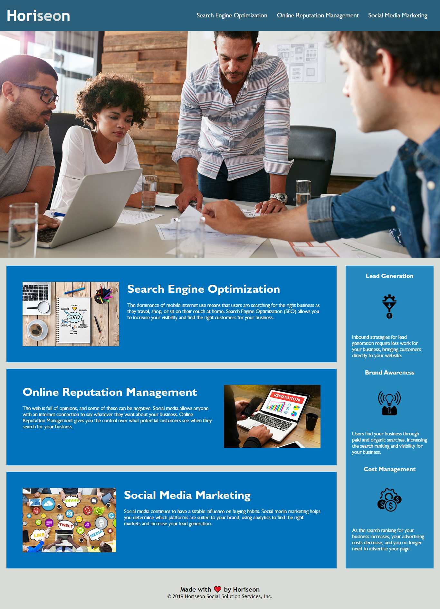

# horiseon-landingpage

Challenge 01 - Optimization and code improvements of Horiseon landingpage.

This is a **On-the-job ticket** or **feature request Challenges** with a givev starter code, which we modify to complete the Challenge.

## User Story

```
AS A marketing agency
I WANT a codebase that follows accessibility standards
SO THAT our own site is optimized for search engines
```

## Acceptance Criteria

```
GIVEN a webpage meets accessibility standards
WHEN I view the source code
THEN I find semantic HTML elements
WHEN I view the structure of the HTML elements
THEN I find that the elements follow a logical structure independent of styling and positioning
WHEN I view the icon and image elements
THEN I find accessible alt attributes
WHEN I view the heading attributes
THEN they fall in sequential order
WHEN I view the title element
THEN I find a concise, descriptive title
```

## Edits

- Use semantinc HTML elements instead of class names like:
- nav instead of div class="header"
- header instead of div class="hero"
- section instead of div class="content"
- aside instead of div
- footer instead of div class="footer"
- Use the same class name for the features sections
- Use the same class name for benefits sections
- Add id jump page to navigation links
- Add comments add css stylesheet
- Optimize file size images

## Mock-Up

The following image shows the web application's appearance and functionality:


